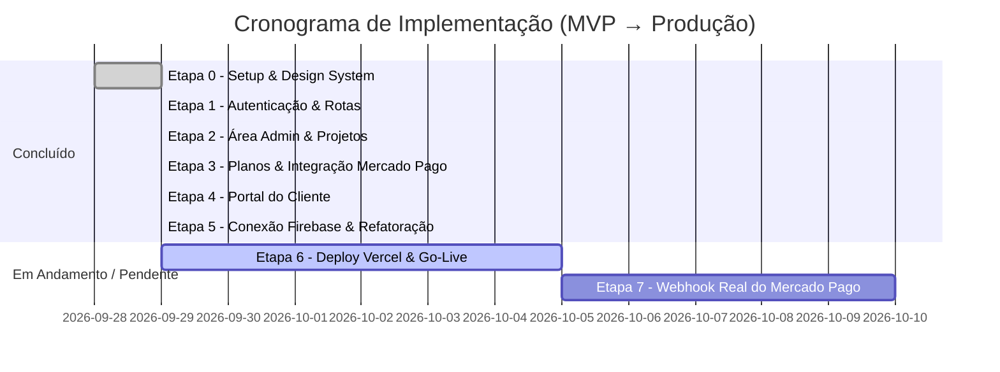

# 🗺️ Plano de Implementação & Status do Projeto: Gestão JGcode

> **Documento Oficial de Acompanhamento do Projeto**  
> **Status Geral do MVP:** **~90% Concluído (Frontend 100% Operacional & Banco Firebase Conectado)**  
> **Última Atualização:** Setembro/2026  
> **Próximo Marco:** Deploy em Produção na Vercel & Webhook Real do Mercado Pago

---

## 📊 Visão Geral do Progresso

---

## 📋 Diagnóstico Detalhado por Etapa

### ✅ Etapa 0: Setup, Arquitetura & Design System
* **Status:** Concluído (100%)
* **Entregas Realizadas:**
  - [x] Inicialização do projeto com Vite, React 19 e TypeScript.
  - [x] Configuração do TailwindCSS com a paleta institucional Apple/JGcode (`#F5F5F7`, `#0071E3`, `#1D1D1F`, sombras suaves `shadow-apple`).
  - [x] Estruturação modular de pastas (`components/`, `pages/`, `services/`, `hooks/`, `types/`).
  - [x] Tipagem estrita de todas as entidades do sistema (`Client`, `Project`, `Payment`, `PaymentPlan`, `SystemUser`).

---

### ✅ Etapa 1: Autenticação & Controle de Acesso
* **Status:** Concluído (100%)
* **Entregas Realizadas:**
  - [x] Separação completa das telas de login:
    - **Portal do Cliente (`/login` e `/login/cliente`):** Acesso limpo com CPF ou CNPJ sem exigir senhas complexas.
    - **Acesso da Equipe (`/admin/login`):** Acesso corporativo com e-mail institucional e senha.
  - [x] Redesign visual das telas com base em referências modernas do Pinterest/Dribbble (arco arquitetônico suave e ilustrações 3D correspondentes).
  - [x] Guarda de rotas protegidas (`ProtectedRoute.tsx`) com redirecionamento baseado no perfil (`client` vs `admin`).
  - [x] Refatoração do código com hooks desacoplados (`useCpfCnpj`, `usePasswordToggle`) e componentes atômicos (`LoginCard`, `LoginVisualSidebar`).

---

### ✅ Etapa 2: Área Administrativa (Backoffice)
* **Status:** Concluído (100%)
* **Entregas Realizadas:**
  - [x] **Dashboard Executivo (`/admin` e `/admin/dashboard`):**
    - Cards de indicadores financeiros: Receita Mensal Recorrente (MRR), Clientes Ativos, Faturamento do Mês e Taxa de Inadimplência.
    - Gráficos de faturamento e comparativo.
    - Seção de **Próximos Vencimentos** alinhada e visível em tela cheia sem necessidade de rolagem excessiva.
  - [x] **Menu Lateral Retrátil (`AdminLayout.tsx`):**
    - Suporte a colapso e expansão com ícones e persistência no navegador.
  - [x] **Gestão de Clientes (`AdminClientsPage.tsx`):**
    - Listagem com pesquisa em tempo real (nome, razão social, documento).
    - Modal de cadastro de novos clientes com validação de CPF/CNPJ.
  - [x] **Detalhes do Cliente & Gestão de Projetos (`AdminClientDetailPage.tsx`):**
    - Informações cadastrais completas.
    - Cadastro e **edição de projetos já salvos** (links de publicação, notas técnicas, domínio, DNS e tipo de serviço: GMB, Site, E-mail Pro, etc.).
    - Gestão financeira do cliente com opção de **baixa manual** pelo administrador.
  - [x] **Gestão de Usuários da Equipe (`AdminUsersPage.tsx`):**
    - Controle de colaboradores internos (Super Admin, Gerente de Projetos, Suporte, Financeiro).

---

### ✅ Etapa 3: Planos de Pagamento & Gateway Troçável
* **Status:** Concluído (95% - Modo MVP Operacional)
* **Entregas Realizadas:**
  - [x] Suporte aos modelos de cobrança: **À Vista**, **Parcelado** (com divisão automática) e **Recorrente / Mensalidade**.
  - [x] Arquitetura de Gateway orientada à interface `IPaymentProvider` com classe `MercadoPagoProvider`.
  - [x] **Modal Pix Interativo (`PixModal.tsx`):**
    - Renderização dinâmica do QR Code.
    - Linha digitável Pix Copia-e-Cola com botão de cópia rápida em 1 clique.
    - Contador regressivo de expiração (30 minutos).
    - Botão de simulação de baixa automática para testes.
  - [x] Opção de baixa manual pelo administrador (dinheiro, transferência ou TED).

---

### ✅ Etapa 4: Portal do Cliente (Autoatendimento)
* **Status:** Concluído (100%)
* **Entregas Realizadas:**
  - [x] Repaginação focada no objetivo principal: **receber pagamentos do cliente com o menor atrito possível**.
  - [x] Card de destaque para faturas pendentes ou em atraso com botão imediato **"Pagar com Pix"**.
  - [x] Histórico de mensalidades quitadas com data e identificador.
  - [x] Acompanhamento de serviços e projetos contratados com botões diretos para os links de publicação (Google Maps, sites, etc.).
  - [x] Canal de suporte direto no WhatsApp da JGcode integrado.

---

### ✅ Etapa 5: Conexão Firebase & Limpeza de Dados
* **Status:** Concluído (100%)
* **Entregas Realizadas:**
  - [x] Conexão com o projeto oficial em nuvem **`gestaojgcode`** no Firebase Firestore.
  - [x] Criação dos arquivos `.env` e `.env.local` com as chaves reais do SDK web.
  - [x] Criação de `firestoreService.ts` com suporte às coleções: `clients`, `projects`, `plans` e `payments`.
  - [x] Regras de segurança do Firestore (`firestore.rules`) e configuração de deploy (`firebase.json`).
  - [x] **Limpeza total dos dados fakes/demo:** banco e código limpos (0 clientes falsos), prontos para receber cadastros reais.

---

## ⏳ O Que Ainda Falta para Produção (Go-Live)

Abaixo estão as pendências organizadas por prioridade para publicação final:

| Prioridade | Tarefa | Descrição | Onde Fazer |
| :---: | :--- | :--- | :--- |
| **Alta** | **Deploy na Vercel** | Subir o projeto para a Vercel com as variáveis de ambiente (`VITE_FIREBASE_*`) e vincular o domínio customizado (ex: `gestao.jgcode.com.br`). | Vercel / GitHub |
| **Alta** | **Deploy das Regras do Firestore** | Publicar o arquivo `firestore.rules` no Firebase Console ou via `firebase deploy --only firestore:rules`. | Firebase CLI / Console |
| **Média** | **Token Real do Mercado Pago** | Configurar a credencial de produção `MP_ACCESS_TOKEN` no arquivo `.env` para emissão de Pix em conta bancária real da JGcode. | Mercado Pago Developers |
| **Média** | **Webhook de Confirmação Pix** | Implementar a Serverless Function na Vercel (`/api/webhooks/mercadopago.ts`) para receber a notificação bancária de pagamento e marcar a fatura como `PAID` automaticamente em tempo real sem precisar de simulação. | Vercel Serverless |
| **Baixa** | **Notificações Automáticas** | Disparo de lembretes de vencimento via WhatsApp (Evolution API / Z-API) ou e-mail corporativo. | Cloud Function / Webhook |

---

## 🎯 Próximo Passo Recomendado

1. **Testar o primeiro cadastro real:** Entrar no painel administrativo com `admin@jgcode.com` / `admin123` e cadastrar o primeiro cliente e projeto real.
2. **Realizar o Deploy na Vercel:** Conectar o repositório à Vercel para publicação em ambiente web acessível pelo cliente final.
